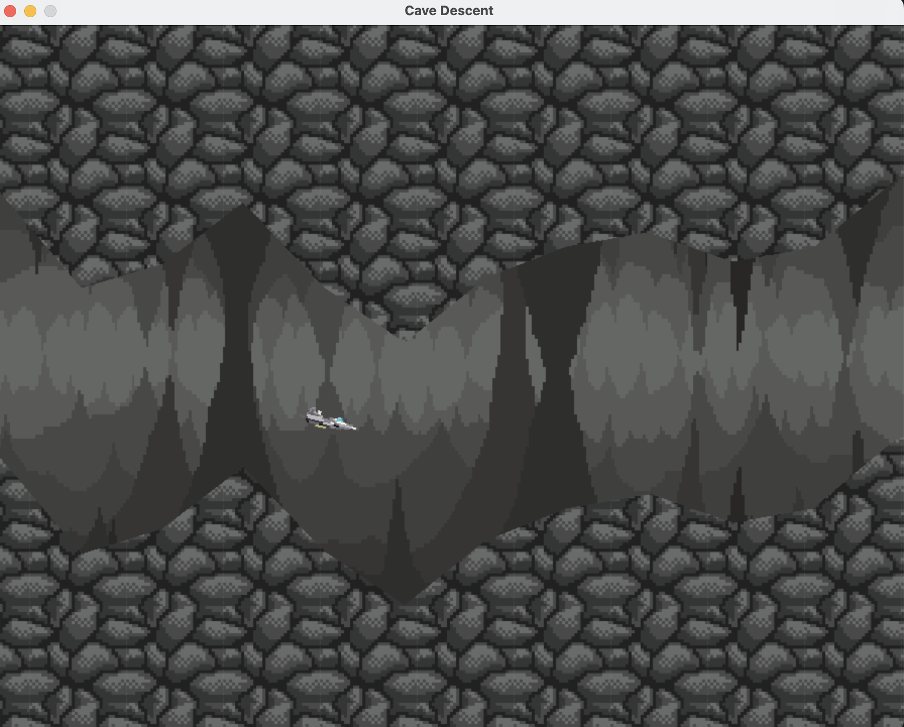

# Cave Descent with Deep Reinforcement Learning 

This project was carried out for [HackUPC 2025](https://hackupc-2025.devpost.com/).
It is a simple side-scroller game environment designed for training reinforcement learning agents, using a deep Q-learning approach to validate the agent's performance in a dynamically generated terrain.

## Devpost
See the detailed description of the project [here](https://devpost.com/software/rocket-deep-reinforcement-learning).

## Demo
See the [demo video](https://youtu.be/yS4YqpJ8GS0) below:

